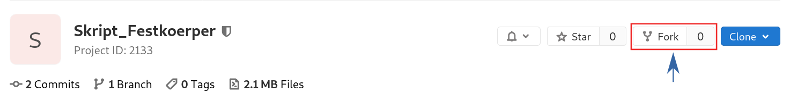
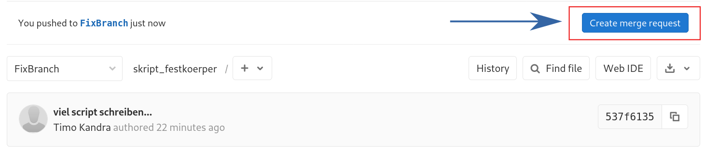

# Festkörpervorlesung
von Frau Prof. Weig

## About:
Das Skript wurde während der Vorlesung mitgeschrieben (2019/2020). 
Natürlich ist weder Richtigkeit noch Vollständigkeit garantiert.
Sehr gerne können Merge Request erstellt werden mit Verbesserungen. 
Diese sollte dann auch recht schnell gemerged werden. 
Sollten die maintainer nicht mehr aktiv sein kann das Repository sehr gerne geForked und weitergeführt werden.

**Liebe Grüße**\
Stefan Florian Timo

## How to contribute:
Es wird ein installiertes Latex environment benötigt (empfohlen ist VSCode, da sehr gute git integration...)
  1. *git* installieren
  2. Projekt forken: \
  
  3. Link des geForkten Projekts kopieren (clone button copy ssh oder copy https)
  4. Repository klonen um es zu bearbeiten: \
   `git clone {Link}`
   Beispiel: \
   `git clone git@git.uni-konstanz.de:timo.kandra/skript_festkoerper.git`
  5. Neuen Working Branch erstellen: \
   `git checkout -b FixBranch` 
  6. Gewünschte Änderungen durchführen
  7. `git add .` dann `git commit -m 'Message (z.b. Fehlendes Quadrat hinzugefuegt)'`
  8. `git push origin FixBranch`
  9. Nun kann auf Gitlab ein Merge Request erstellt werden  Dieses muss auf den Upstream gebracht werden also von `your.name/FixBranch` zu `Timo.Kandra/master`
  10. Dann kann ein Maintainer deine Änderungen mergen.
